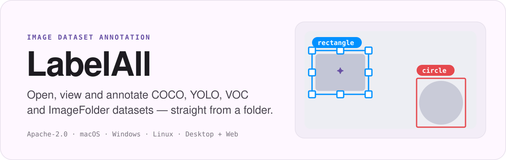
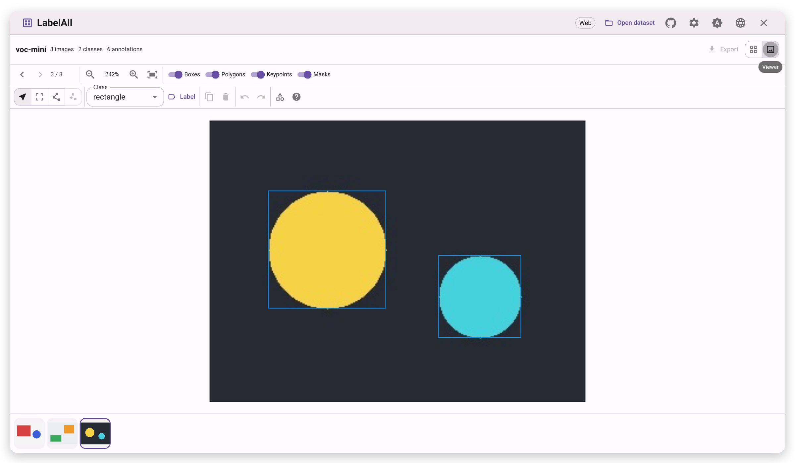
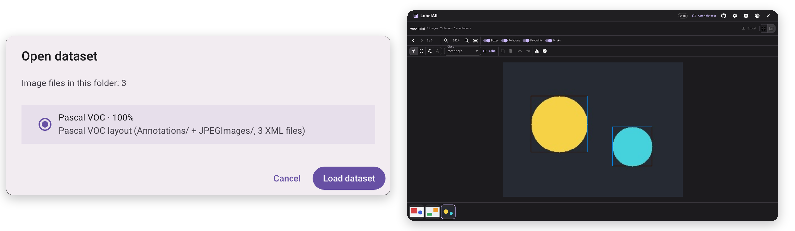

<p align="center">
  
</p>

<p align="center">
  <a href="./LICENSE"></a>
  <a href="../../releases"></a>
  <a href="https://hub.docker.com/r/ailm32442/labelall"></a>
</p>

<p align="center">
  <b><a href="https://labelall.superagentparty.com/">Live demo</a></b> ·
  <b><a href="../../releases">Download for desktop</a></b> ·
  <b><a href="#3-run-it-with-docker">Run with Docker</a></b> ·
  <b><a href="./DEPLOY.md">Self-host</a></b>
</p>

<p align="center">
  <a href="README_zh.md">简体中文</a> ·
  <a href="README_zh_TW.md">繁體中文</a> ·
  <a href="README.md">English</a> ·
  <a href="README_ja.md">日本語</a> ·
  <a href="README_ko.md">한국어</a> ·
  <a href="README_es.md">Español</a> ·
  <a href="README_fr.md">Français</a> ·
  <a href="README_de.md">Deutsch</a> ·
  <a href="README_ru.md">Русский</a> ·
  <a href="README_ar.md">العربية</a>
</p>

---

<p align="center">
  
</p>

LabelAll is a **free, open-source** tool for opening, browsing, annotating and exporting common
image datasets. There is no format conversion step and no project file to set up — pick a folder
and it reads what is already there.

It is built for computer-vision engineers, annotation and QA teams, students and researchers, and
anyone who needs to look at or fix a batch of image labels quickly.

## What it does

**Open and go**

- Pick a folder; the dataset format is detected automatically.
- Forgiving reading: broken, missing or non-standard files are skipped and summarised in a dialog,
  so one bad file never blocks the whole dataset.
- A thumbnail list that stays smooth with tens of thousands of images.
- Filter by split (train / val / test) or class, and search by file name; double-click a thumbnail to
  open it in the viewer.

**See clearly**

- Zoom and pan freely, fit to window or inspect at 1:1.
- Boxes, polygons, keypoints and classification tags overlay cleanly, labelled with
  category-coloured chips and coloured by class.
- Toggle any layer on or off; step through images with the arrow keys or the filmstrip.

**Annotate and edit**

- Draw boxes, polygons and keypoints, or add an image-level class label.
- Drag to move, resize with eight handles, duplicate, delete, nudge pixel by pixel, and use the
  right-click menu for quick actions.
- Add, rename, recolour or remove classes at any time; undo and redo whenever you need.

**Export and interop**

- Export to COCO, YOLO, Pascal VOC or classification folders in one step.
- Before exporting, LabelAll **tells you exactly what the target format cannot keep**, and writes
  into a separate folder — your original files are never modified.

**A pleasure to use**

- Light and dark themes with a customisable accent colour and palette.
- Ten interface languages, including right-to-left Arabic; the desktop app updates itself, and the
  web build feels the same.

<p align="center">
  
</p>

## Supported datasets

| Format | Open | Export | Notes |
| --- | :---: | :---: | --- |
| **COCO** | ✅ | ✅ | Polygon and RLE segmentation, keypoints |
| **YOLO** | ✅ | ✅ | Detect, segment and pose tasks |
| **Pascal VOC** | ✅ | ✅ | 1-based boxes, XML next to images or in `Annotations/` |
| **Classification / ImageNet** | ✅ | Partial | The folder name is the class |
| **labelme** | ✅ | — | Interop with labelme |

> MS COCO, ImageNet / ILSVRC, Pascal VOC 2007/2012 and other public datasets can be opened in their
> native format.

## Run it

There are three ways to use LabelAll. All of them run entirely on your machine — the app has **no
backend**, so the images and annotations you open are never uploaded anywhere.

### 1. Try it in the browser

Open **<https://labelall.superagentparty.com/>** and pick a dataset folder. Nothing to install.

> The demo site shows a short storage notice and links to its
> [privacy policy](https://labelall.superagentparty.com/#/privacy) and
> [terms of service](https://labelall.superagentparty.com/#/terms). It is informational only — the
> app sets no cookies and never uploads your datasets. Self-hosted builds do not show it unless you
> build with `VITE_FORCE_LEGAL=1`.

> The web build needs the browser's File System Access API, so it must be served over **HTTPS** (or
> `localhost`). **Chrome / Edge** can read and write; **Firefox / Safari** open datasets read-only.

### 2. Install the desktop app

Grab the installer for your system from the [Releases](../../releases) page — **macOS, Windows and
Linux**. This is the recommended way to annotate, since it can always write back to disk.

> **Windows**: two installers are published. Pick the one ending in `-offline` if the machine has no
> internet access — it bundles the WebView2 runtime. The regular installer downloads WebView2 during
> setup instead, so it is much smaller.

> **First launch on macOS**: the build is not notarized. If macOS says the app is “damaged” or cannot
> verify the developer, run `xattr -cr /Applications/LabelAll.app` in Terminal, then open it — or
> right-click the app and choose “Open”.

### 3. Run it with Docker

The web build is a plain static bundle, so the image is just `nginx` plus the compiled app. The
published image is multi-arch (`linux/amd64` and `linux/arm64`):

```bash
docker run --rm -p 8080:80 ailm32442/labelall:latest
```

Then open <http://localhost:8080>.

Or build it yourself from a checkout:

```bash
docker build -t labelall .
docker run --rm -p 8080:80 labelall

# or
docker compose up -d --build
```

> Tags are built and pushed to Docker Hub automatically when you push a version tag
> (`git tag v0.1.3 && git push origin v0.1.3`), producing semantic-version tags plus `latest`.
> See [DEPLOY.md](./DEPLOY.md) for Docker Hub setup and other hosting options (Cloudflare Pages,
> Netlify, Vercel, …).

## Quick start

1. Open LabelAll and click “Open dataset”, then choose the dataset folder.
2. Confirm the detected format and start browsing.
3. Add or edit annotations, then export to the format you want.

> Want to try it first? [`examples/voc-mini`](./examples/voc-mini) is a three-image Pascal VOC
> dataset — open it directly.

## Keyboard shortcuts

| Action | Shortcut |
| --- | --- |
| Previous / next image | `←` / `→` |
| Select / move · Draw a box · Polygon · Keypoints | `V` · `B` · `P` · `K` |
| Nudge the selected annotation | `Arrows` (hold `Shift` for 10px) |
| Delete / duplicate selection | `Delete` / `Ctrl`·`Cmd` + `D` |
| Undo / redo | `Ctrl`·`Cmd` + `Z` / `Shift` + `Ctrl`·`Cmd` + `Z` |
| Zoom in / out / fit | `+` / `-` / `0` |
| Pan the canvas | Drag the empty canvas, or `Space` + drag |

## Known limitations

- Aimed at datasets of up to ~50k images with annotation files under 100 MB; larger ones are not
  guaranteed to stay smooth yet.
- The web build is read/write in Chrome / Edge and read-only in Firefox / Safari.
- Export writes annotation files only; images are not copied.

## Contributing and license

Issues and pull requests are welcome — see [CONTRIBUTING.md](./CONTRIBUTING.md), and
[RELEASING.md](./RELEASING.md) for release builds. [Apache-2.0](./LICENSE) © 2026 heshengtao.
